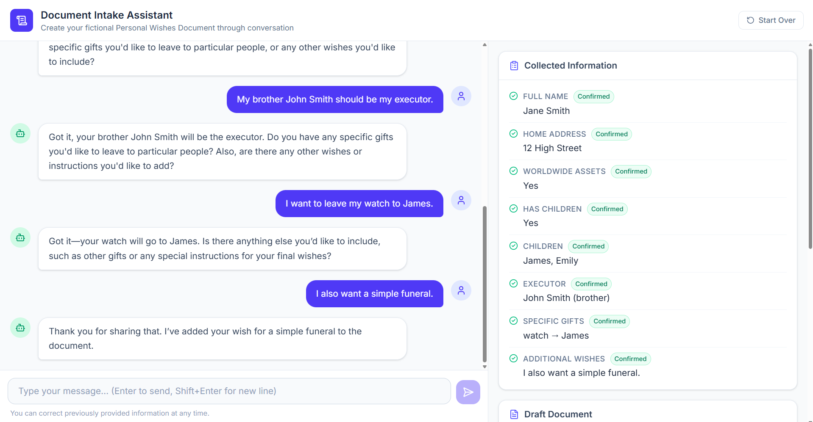
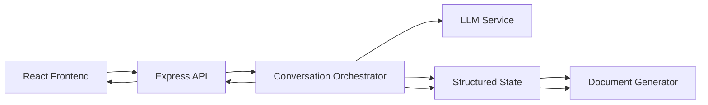

# Document Intake Assistant

A conversational LLM-powered document intake application that interviews users, maintains validated structured state, and generates a fictional Personal Wishes Document from the confirmed information.

> **Note:** This application is fictional and is not legal advice.


### Key Capabilities

- Multi-turn conversational intake
- Structured state as the source of truth
- LLM output validation with Zod
- Correction of previously captured information
- Ambiguity and contradiction handling
- Live structured-state preview
- Live document preview
- Graceful LLM/API error handling
- Automated test coverage

## Application Preview



## Architecture

The application is built with a clear separation of concerns, divided into a React frontend and an Express/TypeScript backend. The backend acts as the sole source of truth for the conversation and structured state.



- **Frontend/UI**: A React SPA that handles the dual-pane layout, capturing user input, rendering the conversation history, and displaying the live state and document previews.
- **Backend/API**: Exposes REST endpoints to manage sessions and process messages.
- **Conversation Orchestrator**: The central brain of the backend. It receives user messages, appends them to the session history, queries the LLM, validates the response, merges new data into the structured state, and triggers document regeneration.
- **Structured State**: A strongly typed representation of the collected information (e.g., name, children, executor). Fields use a wrapper to track their status (`unknown`, `unconfirmed`, `confirmed`).
- **LLM Interaction**: A service layer that communicates with the API using JSON mode. It is guided by a strict system prompt to handle ambiguity, contradictions, and partial information gracefully.
- **Document Generation**: A pure function that takes the current structured state and produces a formatted plain-text draft document with required legal disclaimers.

## Tech Stack

- **Frontend**: React, TypeScript, Vite, Tailwind CSS, Lucide React (Icons)
- **Backend**: Node.js, Express, TypeScript, Zod (Validation), uuid
- **Testing**: Vitest
- **LLM Provider Integration**: OpenAI-compatible API interface (configured for Groq/OpenAI via native `fetch`)

## Project Structure

```text
wenup/
├── client/                 # Frontend React Application
│   ├── src/
│   │   ├── components/     # UI Components (Chat, Panels, Inputs)
│   │   ├── services/       # API client wrapper
│   │   ├── types/          # Shared frontend interfaces
│   │   ├── App.tsx         # Main layout and state management
│   │   └── main.tsx        # React entry point
│   ├── index.html
│   └── vite.config.ts
├── docs/                   # Documentation assets
│   └── screenshot.png
├── src/                    # Backend Node.js Application
│   ├── __tests__/          # Comprehensive test suite (129 tests)
│   ├── llm/                # LLM provider implementations
│   ├── config.ts           # Environment variable loading
│   ├── document.ts         # Draft document generation logic
│   ├── index.ts            # Express server entry point
│   ├── llm-parser.ts       # State merging logic
│   ├── orchestrator.ts     # Core conversation & state logic
│   ├── prompts.ts          # LLM system instructions
│   ├── routes.ts           # Express API endpoints
│   ├── schemas.ts          # Zod validation schemas
│   ├── state.ts            # In-memory session store
│   └── types.ts            # Core backend interfaces
├── .env.example
├── package.json
└── vitest.config.ts
```

## Requirements

- Node.js v18 or higher
- An active OpenAI-compatible API Key (e.g. Groq, OpenAI)

## Environment Setup

1. Copy the example environment file:
   ```bash
   cp .env.example .env
   ```
2. Open `.env` and configure your API provider:
   ```env
   # Example configuration
   LLM_PROVIDER=openai
   LLM_API_KEY=your-api-key-here
   LLM_MODEL=llama-3.1-70b-versatile
   LLM_BASE_URL=https://api.groq.com/openai/v1/chat/completions
   ```

## Running the Backend

Install dependencies and start the development server:

```bash
npm install
npm run dev
```
The backend will run on `http://localhost:3000`.

## Running the Frontend

In a separate terminal, navigate to the `client` directory, install dependencies, and start Vite:

```bash
cd client
npm install
npm run dev
```
The frontend will run on `http://localhost:5173`.

## Running Tests

The project includes an exhaustive suite of 129 backend tests covering conversation flow, state corrections, error handling, edge cases, and API contracts.

```bash
# Run all tests once
npm test

# Run tests in watch mode
npm run test:watch
```

## API Endpoints

- `POST /api/sessions`: Creates a new conversation session. Returns a session ID, initial greeting, blank state, and blank document.
- `GET /api/sessions/:sessionId`: Retrieves the current state, message history, and document for an active session.
- `POST /api/sessions/:sessionId/messages`: Submits a user message. Processes the message via the LLM, updates the state, and returns the assistant's reply along with the updated state and document.
- `POST /api/sessions/:sessionId/reset`: Clears the conversation history and resets the structured state and document to blank.
- `GET /health`: Basic health check endpoint.

## Reliability & Design Decisions

- **Structured State as Source of Truth**: The LLM does not generate the document directly. It only extracts structured JSON data. The backend independently validates this data and generates the document programmatically.
- **Strict Validation**: All LLM outputs are validated against Zod schemas. Unexpected fields are aggressively stripped using `.strip()`, and malformed responses are caught before they can corrupt the state.
- **Preservation of Unknowns**: The merging logic (`mergeExtractedFields`) only updates fields explicitly provided in the current turn. Missing fields in the LLM response do not overwrite previously confirmed data.
- **Correction Support**: Users can naturally correct previously provided information (e.g., "Actually, my name is Jane"). The LLM is instructed to output the new value, which cleanly overwrites the old value in the state.
- **Graceful Error Handling**: If the LLM fails (e.g., rate limit, network timeout) or returns unparseable garbage, the orchestrator catches the error, preserves the existing state and document, and injects a fallback apology message into the chat so the user can continue smoothly.

## Limitations

- **In-Memory Sessions**: Session data is stored in memory. Restarting the backend server will destroy all active sessions.
- **No Authentication**: The application currently lacks user authentication and authorization.
- **Plain-Text Document**: The generated document is currently rendered as plain text. 
- **Semantic Contradiction Detection**: While the system prompt instructs the LLM to identify contradictions and ask for clarification, the backend programmatic layer relies on the LLM to follow these instructions rather than independently analyzing the semantic meaning of the text.

## Production Improvements

To prepare this application for a real-world production environment, the following improvements would be necessary:

- **Persistent Storage**: Replace the in-memory session store (`state.ts`) with a robust database (e.g., PostgreSQL or MongoDB) to persist user sessions across server restarts.
- **Authentication & Authorization**: Implement secure user login (e.g., via Auth0 or custom JWTs) and ensure users can only access their own sessions.
- **Stronger Semantic Validation**: Introduce programmatic checks (e.g., secondary LLM evaluation or NLP heuristics) to detect contradictions and validate complex relationships independently of the primary extraction model.
- **Retry Mechanisms**: Implement exponential backoff and automatic retries for transient LLM API failures before surfacing an error to the user.
- **Observability**: Add comprehensive logging, tracing, and monitoring (e.g., Datadog, Sentry) to track LLM performance, token usage, and error rates.
- **Secure Document Generation**: Upgrade the document generation layer to produce secure, downloadable PDFs with proper formatting, rather than rendering plain text.
- **Rate Limiting**: Apply strict rate limiting on the API endpoints to prevent abuse and manage API costs.
- **Conversation Windowing**: Implement summarization or sliding window techniques to handle extremely long conversations without exceeding LLM context limits.
